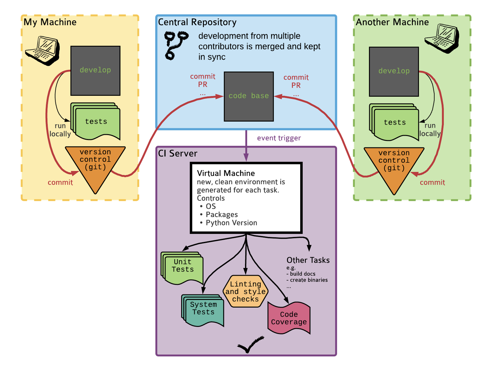

# Continuous Integration with GitHub Actions

## Introduction
Welcome to the Testing Project! This repository serves as an example for the ASPP Summer School's testing and debugging class. It provides an example of continuous integration using GitHub Actions.

Github Actions is a CI server provided by Github. Other Options include Travis and CircleCI.

## Behind the Scenes
The idea behind continuous integration with GitHub Actions is that when an event occurs, such as a pull request being opened or a commit tag being pushed, GitHub searches for configuration files in the `.github/workflows` folder at that specific commit SHA. It then looks for a trigger that matches the event and creates a virtual machine as specified in the configuration file. Finally, it runs the commands listed in the configuration file on the virtual machine. This allows for automated testing and integration of code changes.

## GitHub Actions Configuration
To configure the continuous integration workflow, please refer to the `.github/workflows` folder in this repository.

For more details: https://docs.github.com/en/actions/writing-workflows/quickstart

Happy testing!

